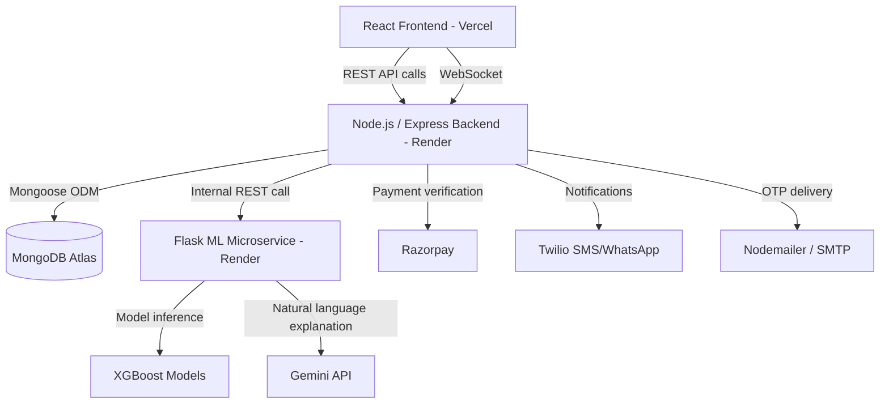
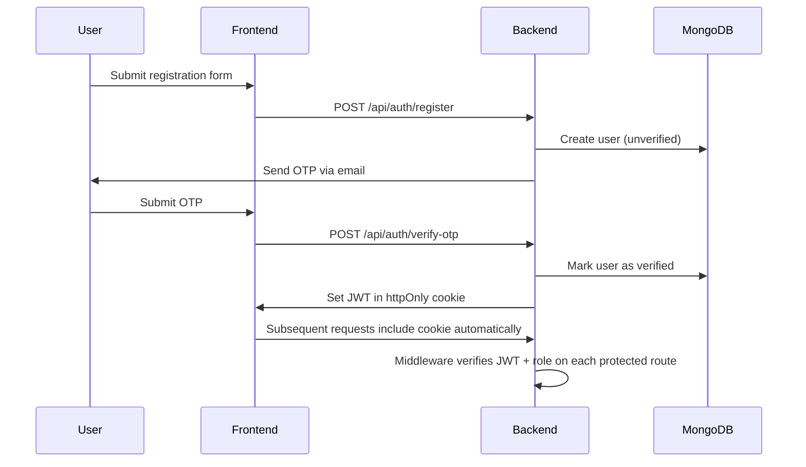
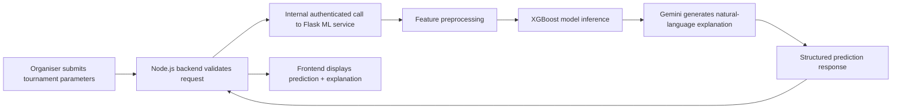
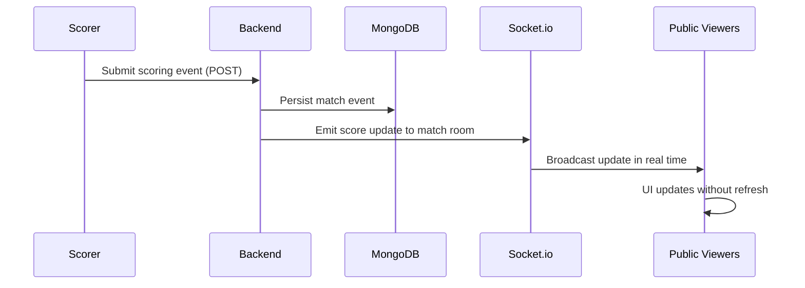

# 🏆 Sportfolio

**Where local sports tournaments meet financial intelligence.**

A full-stack platform that digitizes the complete lifecycle of grassroots sports tournament management — registration, payments, live scoring, sponsorship, and financial reporting — powered by a machine learning service that gives organizers data-driven guidance previously available only to professional event management companies.

---

## 📖 Project Overview

India runs thousands of local sports tournaments every month — cricket, football, kabaddi, badminton, basketball, and volleyball events organized by clubs, colleges, and community groups. Almost all of them are run the same way: team registrations collected over WhatsApp, entry fees paid in cash, brackets drawn by hand, and financial summaries (if they exist at all) calculated on a notebook or spreadsheet after the event ends.

**Sportfolio** replaces that manual workflow with a structured digital platform. It was built to answer a simple question: *what would a local tournament organizer's toolkit look like if it had the same level of engineering investment as a professional sports management product?*

The platform serves five distinct user roles, each with a dedicated portal:

| Role | What they do |
|---|---|
| **Organiser** | Creates tournaments, manages registrations, schedules matches, tracks finances, generates reports |
| **Captain** | Registers a team, pays the entry fee, tracks match results |
| **Sponsor** | Browses tournaments, evaluates ROI before committing, pays for sponsorship tiers |
| **Scorer** | Submits live ball-by-ball / point-by-point scoring data during matches |
| **Public** | Views tournaments, brackets, and live scorecards without needing an account |

### What makes Sportfolio different

Most sports management tools stop at scheduling and scorekeeping. Sportfolio goes further by treating a tournament as a **financial event**, not just a sporting one:

- A dedicated **machine learning microservice** (XGBoost models served via Flask) predicts entry fees, forecasts registration outcomes, and estimates sponsor ROI — turning organizer guesswork into data-backed decisions.
- Since no historical tournament dataset existed at the start of the project, the ML models are trained on **synthetically generated data built from domain-specific pricing and demand formulas**, not arbitrary random data — a deliberate engineering decision to bootstrap ML capability before real usage data exists.
- A full **expense tracker and aggregate finance dashboard** gives organizers genuine profit & loss visibility across all their tournaments, something no WhatsApp-based workflow can offer.
- **Live scoring over WebSockets** means spectators and remote parents can follow a match in real time, with no app installation and no login required.

---

## ✨ Key Features

### 🔐 Authentication & Security
- Email/password registration with **OTP-based email verification** (6-digit code, bcrypt-hashed, time-limited)
- **JWT authentication** delivered via httpOnly cookies (not accessible to client-side JavaScript)
- **Role-based access control** middleware enforced on every protected API route
- Razorpay payment signatures verified server-side using cryptographic HMAC validation before any database write

### 🏟️ Tournament Management
- Multi-step tournament creation wizard (basic info → dates → format/teams → finance → review)
- Automatic tournament status lifecycle (`upcoming → registration → ongoing → completed`) driven by date comparisons
- Support for **knockout**, **league**, and **league + knockout** formats with automated bracket generation
- Tournament discovery via public browsing or a unique join code

### 👥 Team Registration & Payments
- Captain-driven team registration with player roster management
- **Razorpay integration** for entry fee collection, with automatic waitlisting once a tournament reaches capacity
- Payment verification flow that guarantees a team is only created after a cryptographically validated payment

### 🎯 Live Scoring (Real-Time)
- Sport-specific scoring interfaces for **cricket, football, badminton, kabaddi, basketball, and volleyball**
- **Socket.io**-powered real-time score broadcasting to public scorecards — no refresh needed
- Per-match event logging for granular statistics and post-match reporting

### 💰 Sponsorship & Finance
- Tiered sponsorship packages (Bronze / Silver / Gold / Platinum) with Razorpay-backed payments
- **Pre-payment ROI estimation** for sponsors, powered by the ML service, before they commit funds
- Expense tracking across categorized cost centers (venue, equipment, officials, etc.)
- Aggregate **Finance Dashboard** across all of an organiser's tournaments — revenue, expenses, and net P&L in one view

### 🤖 ML Prediction Services
- **Entry Fee Predictor** — recommends an optimal entry fee based on tournament parameters
- **Registration Forecaster** — predicts whether a tournament will fill, undersubscribe, or oversubscribe
- **Sponsor ROI Estimator** — estimates audience reach and cost-per-person value for sponsors
- All three exposed as authenticated REST endpoints from the Node.js backend, proxied to an independent Flask microservice

### 📊 Reports & Notifications
- Server-rendered **PDF reports** (financial summaries, team performance, sponsor impact) generated with PDFKit
- Automated **SMS and WhatsApp reminders** for upcoming matches via Twilio, scheduled with `node-cron`

---

## 🎯 Unique Selling Points

| USP | Why it matters |
|---|---|
| **ML-driven financial decisions** | Organizers get a data-backed entry fee recommendation and registration forecast instead of guessing |
| **Synthetic data engineering** | The ML pipeline was bootstrapped using formula-driven synthetic datasets rather than waiting for real-world data to accumulate — a practical, production-realistic approach to the cold-start ML problem |
| **Independent ML microservice** | The XGBoost models run in a separate Flask service, decoupled from the Node.js API, allowing the ML layer to be scaled, retrained, or replaced independently |
| **Real-time scoring infrastructure** | Socket.io powers live, login-free public scorecards — a genuinely real-time feature, not a polling workaround |
| **End-to-end payment integrity** | Razorpay payments are verified server-side before any state change, closing the gap where many hobby projects trust client-reported payment success |
| **Multi-role system design** | Five roles, five distinct authorization boundaries, and five tailored frontend experiences — built on a single shared backend and data model |
| **Production-oriented engineering** | Environment-based configuration, cross-origin cookie authentication, CORS hardening, and a real deployment across Vercel + Render rather than a localhost-only demo |

---

## 🛠️ Tech Stack

### Frontend
| Technology | Purpose |
|---|---|
| React | Core UI library |
| Vite | Build tool & dev server |
| React Router | Client-side routing |
| Socket.io-client | Real-time communication with the backend |
| Axios | HTTP client for API requests |
| Tailwind CSS | Utility-first styling |

### Backend
| Technology | Purpose |
|---|---|
| Node.js | Runtime environment |
| Express.js | Web application framework |
| Socket.io | WebSocket server for live scoring |
| Mongoose | MongoDB object modeling |
| JSON Web Token (jsonwebtoken) | Authentication tokens |
| bcryptjs | Password & OTP hashing |
| node-cron | Scheduled background jobs (reminders) |

### Database
| Technology | Purpose |
|---|---|
| MongoDB Atlas | Primary data store (document-based, cloud-hosted) |

### Machine Learning
| Technology | Purpose |
|---|---|
| Python | ML service language |
| Flask | ML microservice web framework |
| XGBoost | Gradient-boosted model training & inference |
| scikit-learn | Data preprocessing, train/test splitting, evaluation |
| pandas / NumPy | Synthetic data generation & feature engineering |
| joblib | Model serialization |
| Google Generative AI (Gemini) | Natural-language explanation of ML predictions |

### Payments & Communication
| Technology | Purpose |
|---|---|
| Razorpay | Payment gateway (entry fees, sponsorships) |
| Twilio | SMS / WhatsApp reminders |
| Nodemailer | Transactional email (OTP delivery) |
| PDFKit | Server-side PDF report generation |

### Cloud / Deployment
| Technology | Purpose |
|---|---|
| Vercel | Frontend hosting |
| Render | Backend & ML microservice hosting |
| MongoDB Atlas | Managed database hosting |

### Developer Tools
| Technology | Purpose |
|---|---|
| Git & GitHub | Version control |
| dotenv | Environment variable management |
| Nodemon | Local development auto-reload |

---

## 🏗️ System Architecture

Sportfolio is composed of three independently deployable services: a React frontend, a Node.js/Express API backend, and a Python/Flask machine learning microservice — all backed by a shared MongoDB Atlas database.



### Authentication Flow



### ML Prediction Workflow



### Live Scoring Workflow



---

## 📁 Project Structure

```
sportfolio/
├── frontend/                      # React + Vite application
│   ├── src/
│   │   ├── components/             # Reusable UI components
│   │   ├── pages/                  # Route-level page components
│   │   ├── context/                 # AuthContext, SocketContext
│   │   ├── services/                # API service modules (axios wrappers)
│   │   ├── layouts/                  # Role-specific layout shells
│   │   └── App.jsx                   # Root component & routing
│   ├── public/
│   └── vite.config.js
│
├── backend/                       # Node.js + Express API
│   ├── controllers/                # Request handlers (business logic)
│   ├── routes/                     # Express route definitions
│   ├── models/                     # Mongoose schemas
│   ├── middleware/                  # Auth, role-checking, error handling
│   ├── services/                    # Email, SMS, payment, reminder services
│   ├── config/                      # Database connection, environment setup
│   └── server.js                    # Application entry point
│
├── ml/                             # Python Flask ML microservice
│   ├── entry_fee/                  # Entry Fee Predictor
│   │   ├── generate_data.py          # Synthetic dataset generation
│   │   ├── train_model.py             # Model training script
│   │   ├── predictor.py                # Inference logic
│   │   └── model.pkl                    # Serialized trained model
│   ├── registration_forecaster/    # Registration Forecaster
│   │   └── (same structure as above)
│   ├── sponsor_roi/                # Sponsor ROI Estimator
│   │   └── (same structure as above)
│   ├── app.py                       # Flask application & routes
│   └── run.py                        # ML service entry point
│
└── README.md
```

---

## ⚙️ Installation Guide

### Prerequisites

- Node.js (v18 or higher)
- Python (3.10+)
- MongoDB Atlas account (or local MongoDB instance)
- Razorpay account (test mode credentials are sufficient for development)
- Twilio account (for SMS/WhatsApp features)
- Google Gemini API key (for ML explanation generation)

### 1. Clone the repository

```bash
git clone https://github.com/your-username/sportfolio.git
cd sportfolio
```

### 2. Backend setup

```bash
cd backend
npm install
```

Create a `.env` file in `backend/` (see [Environment Variables](#-environment-variables) below).

```bash
npm run dev      # development with auto-reload
# or
npm start        # production
```

### 3. Frontend setup

```bash
cd frontend
npm install
```

Create a `.env` file in `frontend/`:

```env
VITE_API_URL=http://localhost:5000/api
VITE_RAZORPAY_KEY_ID=your_razorpay_key_id
```

```bash
npm run dev       # starts Vite dev server
```

### 4. ML service setup

```bash
cd ml
python -m venv venv
source venv/bin/activate      # Windows: venv\Scripts\activate
pip install -r requirements.txt
```

Create a `.env` file in `ml/` (see [Environment Variables](#-environment-variables) below).

Generate synthetic data and train the models (only required on first setup, or to retrain):

```bash
python entry_fee/generate_data.py
python entry_fee/train_model.py

python registration_forecaster/generate_data.py
python registration_forecaster/train_model.py

python sponsor_roi/generate_data.py
python sponsor_roi/train_model.py
```

Start the ML service:

```bash
python run.py
```

### 5. Database setup

No manual schema setup is required — Mongoose creates collections automatically based on defined schemas when the backend first writes data. Ensure your MongoDB Atlas cluster's IP access list permits connections from your development machine (or `0.0.0.0/0` for ease of development).

### Running the full stack locally

With all three services configured, run each in a separate terminal:

```bash
# Terminal 1
cd backend && npm run dev

# Terminal 2
cd frontend && npm run dev

# Terminal 3
cd ml && python run.py
```

---

## 🔑 Environment Variables

### Backend (`backend/.env`)

| Variable | Purpose | Required | Example |
|---|---|---|---|
| `PORT` | Backend server port | No (defaults to 5000) | `5000` |
| `NODE_ENV` | Environment mode (controls cookie security flags) | Yes | `production` |
| `MONGODB_URI` | MongoDB Atlas connection string | Yes | `mongodb+srv://<user>:<pass>@cluster.mongodb.net/sportfolio` |
| `JWT_SECRET` | Secret key for signing JWTs | Yes | `your_random_secret_string` |
| `EMAIL_USER` | SMTP email address for OTP delivery | Yes | `noreply@example.com` |
| `EMAIL_PASS` | SMTP email password / app password | Yes | `your_app_password` |
| `RAZORPAY_KEY_ID` | Razorpay public key | Yes | `rzp_test_xxxxxxxx` |
| `RAZORPAY_KEY_SECRET` | Razorpay secret key | Yes | `your_razorpay_secret` |
| `TWILIO_ACCOUNT_SID` | Twilio account identifier | Yes | `ACxxxxxxxxxxxxxxxx` |
| `TWILIO_AUTH_TOKEN` | Twilio auth token | Yes | `your_twilio_auth_token` |
| `TWILIO_WHATSAPP_FROM` | Twilio WhatsApp sender number | Yes | `whatsapp:+14155238886` |
| `ML_SERVICE_URL` | Base URL of the Flask ML microservice | Yes | `http://localhost:8000` |
| `FRONTEND_URL` | Allowed CORS origin for the frontend | Yes | `http://localhost:5173` |

### Frontend (`frontend/.env`)

| Variable | Purpose | Required | Example |
|---|---|---|---|
| `VITE_API_URL` | Base URL of the backend API | Yes | `http://localhost:5000/api` |
| `VITE_RAZORPAY_KEY_ID` | Razorpay public key (client-side checkout) | Yes | `rzp_test_xxxxxxxx` |

### ML Service (`ml/.env`)

| Variable | Purpose | Required | Example |
|---|---|---|---|
| `GEMINI_API_KEY` | Google Gemini API key for prediction explanations | Yes | `your_gemini_api_key` |
| `BACKEND_URL` | Allowed CORS origin for incoming requests | Yes | `http://localhost:5000` |
| `PORT` | ML service port | No (defaults to 8000) | `8000` |

> ⚠️ Never commit `.env` files. All values above are placeholders — replace with your own credentials.

---

## 📡 API Documentation

All authenticated routes require a valid JWT, sent automatically via httpOnly cookie after login.

### Authentication

| Method | Endpoint | Purpose | Auth Required | Request Body | Response |
|---|---|---|---|---|---|
| POST | `/api/auth/register` | Register a new user | No | `{ name, email, password, role }` | `{ message, userId }` |
| POST | `/api/auth/verify-otp` | Verify email via OTP | No | `{ userId, otp }` | `{ success, user }` |
| POST | `/api/auth/login` | Log in | No | `{ email, password }` | `{ success, user }` + sets cookie |
| GET | `/api/auth/me` | Get current user | Yes | — | `{ user }` |
| POST | `/api/auth/logout` | Log out | Yes | — | `{ success }` |

### Tournaments

| Method | Endpoint | Purpose | Auth Required | Request Body | Response |
|---|---|---|---|---|---|
| POST | `/api/tournaments` | Create a tournament | Yes (Organiser) | Tournament details object | `{ tournament }` |
| GET | `/api/tournaments` | List/browse tournaments | No | — | `{ tournaments[] }` |
| GET | `/api/tournaments/:id` | Get tournament details | No | — | `{ tournament }` |
| PUT | `/api/tournaments/:id` | Update tournament | Yes (Organiser) | Partial tournament object | `{ tournament }` |
| GET | `/api/tournaments/code/:code` | Find tournament by join code | No | — | `{ tournament }` |

### Teams & Registration

| Method | Endpoint | Purpose | Auth Required | Request Body | Response |
|---|---|---|---|---|---|
| POST | `/api/teams` | Register a team | Yes (Captain) | `{ tournamentId, teamName, players[] }` | `{ team }` |
| POST | `/api/teams/verify-payment` | Verify Razorpay payment | Yes (Captain) | `{ orderId, paymentId, signature }` | `{ success }` |
| GET | `/api/teams/my-teams` | Get captain's registered teams | Yes (Captain) | — | `{ teams[] }` |

### Matches & Scoring

| Method | Endpoint | Purpose | Auth Required | Request Body | Response |
|---|---|---|---|---|---|
| GET | `/api/matches/:tournamentId` | Get matches for a tournament | No | — | `{ matches[] }` |
| POST | `/api/matches/:id/score` | Submit a scoring event | Yes (Scorer) | Sport-specific event payload | `{ match }` + Socket.io broadcast |
| GET | `/api/matches/:id` | Get a single match / live scorecard | No | — | `{ match }` |

### Sponsorships

| Method | Endpoint | Purpose | Auth Required | Request Body | Response |
|---|---|---|---|---|---|
| POST | `/api/sponsorships` | Create a sponsorship | Yes (Sponsor) | `{ tournamentId, tier }` | `{ sponsorship }` |
| POST | `/api/sponsorships/verify-payment` | Verify sponsorship payment | Yes (Sponsor) | `{ orderId, paymentId, signature }` | `{ success }` |
| GET | `/api/sponsorships/:tournamentId` | Get sponsorships for a tournament | Yes (Organiser) | — | `{ sponsorships[] }` |

### ML Predictions

| Method | Endpoint | Purpose | Auth Required | Request Body | Response |
|---|---|---|---|---|---|
| POST | `/api/ml/entry-fee` | Predict optimal entry fee | Yes (Organiser) | Tournament parameters | `{ prediction, explanation }` |
| POST | `/api/ml/registration-forecast` | Forecast registration outcome | Yes (Organiser) | Tournament + registration data | `{ prediction, explanation }` |
| POST | `/api/ml/sponsor-roi` | Estimate sponsor ROI | Yes (Organiser/Sponsor) | Tournament + sponsorship tier | `{ prediction, explanation }` |

### Reports

| Method | Endpoint | Purpose | Auth Required | Request Body | Response |
|---|---|---|---|---|---|
| GET | `/api/reports/financial/:tournamentId` | Generate financial summary PDF | Yes (Organiser) | — | PDF file stream |
| GET | `/api/reports/team-performance/:teamId` | Generate team performance PDF | Yes | — | PDF file stream |
| GET | `/api/reports/sponsor-impact/:sponsorshipId` | Generate sponsor impact PDF | Yes (Sponsor/Organiser) | — | PDF file stream |

### Common Status Codes

| Code | Meaning |
|---|---|
| `200` | Success |
| `201` | Resource created |
| `400` | Validation error / bad request |
| `401` | Unauthorized / invalid credentials |
| `403` | Forbidden — insufficient role permissions |
| `404` | Resource not found |
| `500` | Internal server error |

---

## 🗄️ Database Design

Sportfolio uses **MongoDB**, with Mongoose providing schema structure and validation on top of its flexible document model. Key collections:

| Collection | Purpose | Key Fields |
|---|---|---|
| `users` | All user accounts across all roles | `name, email, password (hashed), role, isVerified, otp` |
| `tournaments` | Tournament definitions | `name, sport, format, organiser (ref), entryFee, status, joinCode` |
| `teams` | Registered teams | `tournament (ref), captain (ref), teamName, players[], paymentStatus` |
| `matches` | Match fixtures & live scores | `tournament (ref), teams[], format-specific score object, status` |
| `sponsorships` | Sponsorship records | `tournament (ref), sponsor (ref), tier, amount, paymentStatus` |
| `expenses` | Tournament expense entries | `tournament (ref), category, amount, description` |

### Relationships

- A **Tournament** is created by one **Organiser** (`User`) and has many **Teams**, **Matches**, **Sponsorships**, and **Expenses**.
- A **Team** belongs to one **Tournament** and is captained by one **User**.
- A **Match** references the **Tournament** and the participating **Teams**.
- A **Sponsorship** links a **Sponsor** (`User`) to a **Tournament**.

### Data Modeling Decisions

- **Document references** (`ObjectId` with `ref`) are used rather than embedding, since teams, matches, and sponsorships are independently queried and updated at high frequency relative to the parent tournament.
- Match score structures are **format-specific** (different fields for cricket vs. football vs. badminton, etc.) rather than forcing a single rigid schema, reflecting the genuinely different data shapes each sport requires.
- Indexes are applied on frequently queried reference fields (`tournament`, `organiser`, `captain`) to keep dashboard and listing queries performant as data volume grows.

---

## 🤖 Machine Learning Services (Detailed)

Sportfolio's ML capability is delivered as an independent Flask microservice rather than embedded logic in the Node.js backend. This separation allows the ML layer to use the Python data science ecosystem natively and to be scaled, redeployed, or retrained without touching the main application server.

Because no historical tournament dataset existed at project inception, all three models are trained on **synthetically generated data**, built from formulas that encode realistic domain assumptions about Indian sports tournament economics (entry fee ranges by sport and city tier, typical registration growth curves, sponsorship value benchmarks, etc.), rather than purely random values.

### 1. Entry Fee Predictor

- **Purpose:** Recommend an optimal entry fee for a tournament before it opens for registration.
- **Problem it solves:** First-time organizers routinely under-price or over-price entry fees with no reference point, leading to either revenue shortfalls or poor registration turnout.
- **Input:** Sport, city tier, number of teams expected, tournament duration, format, prize pool target, and related tournament parameters.
- **Output:** A recommended entry fee, along with a natural-language explanation of the reasoning generated via the Gemini API.
- **Synthetic data generation:** A custom script (`generate_data.py`) produces training records using formulas that combine sport-specific base pricing, city-tier multipliers, and prize-pool-driven adjustments, with randomized noise to avoid overly deterministic patterns.
- **Model:** XGBoost Regressor.
- **Training pipeline:** Data generation → preprocessing/encoding → train/test split → XGBoost training (`train_model.py`) → model serialization with `joblib`.
- **Inference workflow:** Frontend submits tournament parameters → Node.js backend validates and forwards the request → Flask service loads the serialized model and returns a prediction → Gemini generates a contextual explanation → combined response returned to the frontend.

### 2. Registration Forecaster

- **Purpose:** Predict whether a tournament's registrations will fill, fall short, or oversubscribe relative to capacity.
- **Problem it solves:** Organizers need early warning if a tournament is under-registering, so they can extend deadlines, adjust pricing, or increase promotion before it's too late.
- **Input:** Current registration count, days remaining until the registration deadline, entry fee, sport, and tournament capacity.
- **Output:** A classification prediction (e.g., likely to fill / likely to undersubscribe / likely to oversubscribe) with an explanation.
- **Synthetic data generation:** Registration trajectories are simulated using growth-curve formulas that model how registrations typically accumulate over a registration window, with controlled variation to represent different demand scenarios.
- **Model:** XGBoost Classifier.
- **Training pipeline:** Same structure as the Entry Fee Predictor — synthetic generation, preprocessing, train/test split, training, and serialization.
- **Inference workflow:** Identical proxy pattern through the Node.js backend to the Flask service, returning a classification result and explanation to the organiser dashboard.

### 3. Sponsor ROI Estimator

- **Purpose:** Estimate the audience reach and value a sponsor can expect from sponsoring a tournament at a given tier, before they commit funds.
- **Problem it solves:** Sponsors currently have no objective way to evaluate whether a sponsorship is worth the asking price, which suppresses sponsorship conversion for organizers.
- **Input:** Tournament sport, expected team/player count, format, sponsorship tier, and tournament duration.
- **Output:** An estimated reach/value score and a natural-language ROI summary.
- **Synthetic data generation:** Reach estimates are generated from formulas combining player counts, typical spectator multipliers per sport, and tier-based sponsorship value assumptions.
- **Model:** XGBoost Regressor.
- **Inference workflow:** Exposed to both Organiser and Sponsor roles, surfaced in the sponsor-facing browsing experience so sponsors can evaluate ROI *before* paying, not just after.

> **Note on metrics:** Specific accuracy/error metrics are intentionally not published here as they depend on the most recent training run and synthetic dataset version. The training scripts in each model's directory output evaluation metrics directly when executed.

---

## 🔐 Authentication & Authorization

- **Password security:** All passwords are hashed using `bcryptjs` before storage — plaintext passwords are never persisted.
- **Email verification:** New accounts must verify a 6-digit OTP (itself hashed and time-limited) before they can log in, preventing fake or unverified accounts from accessing the platform.
- **JWT-based sessions:** Upon successful login or OTP verification, the backend issues a JSON Web Token containing the user's ID and role, signed with a server-side secret.
- **httpOnly cookies:** The JWT is delivered via an httpOnly cookie rather than being exposed to client-side JavaScript, mitigating XSS-based token theft.
- **Cross-origin cookie handling:** Since the frontend (Vercel) and backend (Render) are deployed on different domains, cookies are configured with `sameSite: 'none'` and `secure: true` in production to allow authenticated cross-origin requests while remaining HTTPS-only.
- **Role-based access control:** Middleware inspects the decoded JWT's role claim on every protected route and rejects requests where the authenticated user's role doesn't match the route's required permissions (e.g., only an Organiser can create a tournament; only a Scorer assigned to a match can submit scores for it).
- **Protected routes:** Both the Express backend and the React frontend enforce route protection — the backend as the source of truth, the frontend to prevent unauthorized UI access and redirect appropriately.

---

## 🔄 Application Workflow

1. **User registration & login** — A user signs up, verifies their email via OTP, and logs in. The backend issues a JWT cookie scoping their session to their role.
2. **Tournament creation** — An Organiser creates a tournament through the multi-step wizard. The backend persists the tournament and generates a unique join code.
3. **ML-assisted pricing** — Before publishing, the Organiser can request an ML-generated entry fee recommendation. The backend forwards the request to the Flask ML service, which returns a prediction and a Gemini-generated explanation.
4. **Team registration** — Captains discover the tournament (via browsing or join code), register a team, and pay the entry fee through Razorpay. The backend verifies the payment signature before persisting the team as confirmed.
5. **Sponsorship** — Sponsors browse open tournaments, request an ROI estimate from the ML service, and — if satisfied — purchase a sponsorship tier through Razorpay.
6. **Match scheduling & live scoring** — As the tournament progresses, assigned Scorers submit live scoring events through sport-specific interfaces. Each event is persisted and broadcast in real time via Socket.io to anyone viewing the public scorecard.
7. **Financial tracking** — Throughout the tournament, the Organiser logs expenses. The Finance Dashboard aggregates entry fee revenue, sponsorship revenue, and expenses into a live profit & loss view.
8. **Reporting** — After the tournament concludes, the Organiser (or Sponsor) can generate PDF reports — financial summaries, team performance, or sponsor impact — rendered server-side with PDFKit.
9. **Notifications** — Throughout the process, automated SMS/WhatsApp reminders are sent to relevant users ahead of scheduled matches.

---

## 📸 Screenshots

> Screenshots to be added.


---

## ⚡ Performance Optimizations

- **Database indexing** on frequently queried reference fields (`tournament`, `organiser`, `captain`) to keep listing and dashboard queries fast as data scales.
- **Server-side payment verification** is performed once, synchronously, before any state-changing write — avoiding redundant database round-trips for unverified payments.
- **In-memory model loading** — the ML microservice loads serialized models once at startup rather than reading from disk on every inference request, keeping prediction latency low.
- **Independent ML service scaling** — because the ML layer is a separate deployable service, it can be scaled or restarted independently of the main API without affecting core tournament/registration functionality.
- **WebSocket room-based broadcasting** — live score updates are emitted only to clients subscribed to a specific match, rather than broadcasting globally, reducing unnecessary network traffic.
- **PDF generation on-demand** — reports are generated only when requested rather than precomputed and stored, avoiding unnecessary storage and staleness issues.

---

## 🛡️ Security Features

- Environment-based secrets management — all credentials (database URI, JWT secret, payment keys, third-party API keys) are loaded from environment variables, never hardcoded.
- **CORS configuration** restricts which origins can call the backend and ML service APIs, set explicitly per environment (development vs. production).
- **httpOnly, secure, sameSite cookies** for JWT delivery, mitigating common token theft vectors.
- **Server-side authorization checks** on every protected route — the frontend's role-based UI is a convenience layer, not the actual security boundary.
- **Payment signature verification** ensures that payment confirmations cannot be spoofed by a client-side request alone.
- **Password and OTP hashing** via bcrypt, with no plaintext credentials ever persisted.

---

## 🧩 Challenges Faced

- **Bootstrapping ML without real data:** With no historical tournament dataset available, the team had to design synthetic data generation formulas that were realistic enough to produce models with genuine predictive structure rather than noise. This was addressed by grounding each formula in domain assumptions (sport-specific pricing tiers, realistic registration growth curves) rather than uniform randomness.
- **Cross-origin authentication in production:** Deploying the frontend and backend on separate domains (Vercel and Render) broke the default cookie-based authentication flow that worked locally. This required explicitly configuring `sameSite: 'none'` and `secure: true` cookie attributes alongside precise CORS origin allowlisting.
- **Coordinating real-time and persistent state:** Live scoring needed to be both immediately broadcast (via Socket.io) and reliably persisted (via MongoDB) without one path lagging or losing data relative to the other, requiring a consistent write-then-broadcast pattern in the scoring controllers.
- **Decoupling the ML service safely:** Running ML inference as a separate Flask service introduced an internal network boundary that needed its own authentication/origin restrictions, distinct from the user-facing JWT system, to prevent the ML endpoints from being called directly by untrusted clients.

---

## 🚀 Future Enhancements

- Replace synthetic training data with real tournament data as the platform accumulates usage history, and establish a periodic retraining pipeline.
- Add a dedicated admin role with platform-wide oversight (tournament moderation, user management, dispute handling).
- Introduce push notifications (web push) as an alternative to SMS/WhatsApp for cost efficiency at scale.
- Expand the ML layer with a player/team performance prediction model using accumulated match statistics.
- Add automated bracket re-seeding when teams withdraw post-registration.
- Containerize all three services (frontend, backend, ML) with Docker Compose for simplified local onboarding.

---

## 📚 Lessons Learned

- **Service decomposition trade-offs:** Splitting the ML service from the main backend clarified the real cost of microservice boundaries — independent deployability and scaling came with the overhead of managing inter-service authentication and network configuration.
- **Synthetic data as an engineering tool, not a shortcut:** Building the synthetic data generators required as much domain thinking as the model training itself — a poorly designed generator produces a model that's confidently wrong, not just inaccurate.
- **Cookie-based auth across origins is not "set and forget":** What works seamlessly on `localhost` can silently break in production due to browser-enforced cross-origin cookie policies, reinforcing the importance of testing authentication flows in a deployed environment early.
- **Payment systems demand a "trust nothing from the client" mindset:** Designing the Razorpay verification flow clarified why payment confirmation must always be re-validated server-side, regardless of what the client reports.
- **Real-time and REST are complementary, not competing:** Socket.io and REST endpoints were used for what each does best — Socket.io for ephemeral live updates, REST for durable state changes — rather than forcing one paradigm to do both jobs.

---


---

<p align="center">Built with a genuine intent to give grassroots sports organizers the tools that professional event companies already have.</p>
